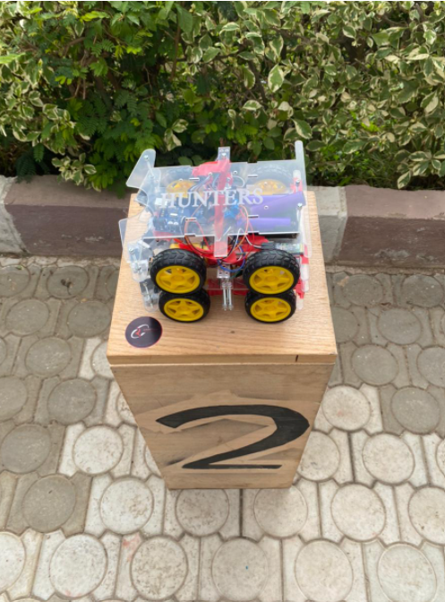
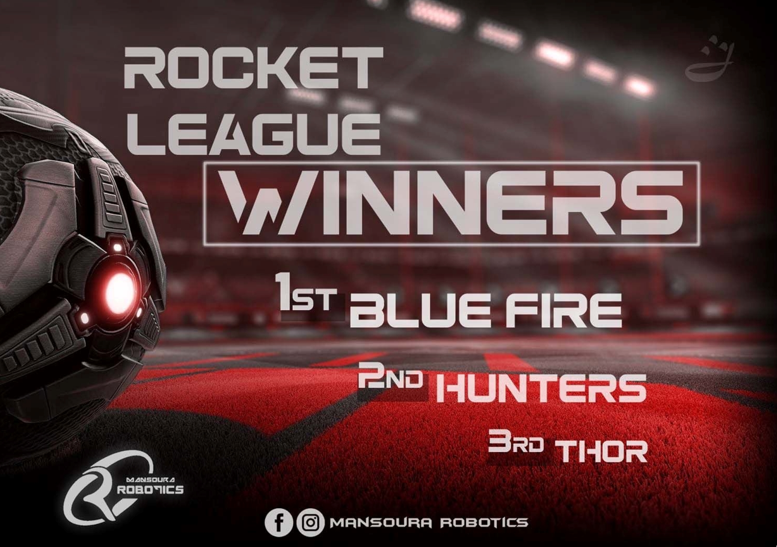

# RC Car Arduino Project

This project contains the code for controlling an RC car using Arduino. The Arduino code is designed to receive commands from a smart phone app through bluetooth module interfaceand control the movement of the car accordingly.

## Requirements

- Arduino board
- Motor driver (L298N)
- DC motors for driving
- Power source (batteries)
- Bluetooth module (for remote control via smartphone)

## Usage

1. Send commands to the Arduino board using the smarth phone app through bluetooth module:
   - 'F': Move forward
   - 'B': Move backward
   - 'L': Turn left
   - 'R': Turn right
   - 'G': Rotate left (alternative command)
   - 'I': Rotate right (alternative command)
2. The car will respond to the commands accordingly.

# About The Rocket League Competition

Rocket League - Gameplay Overview

Rocket League is a competitive game where two teams of robots engage in soccer matches. This README provides a concise overview of the gameplay rules:

## Game Procedure and Length

- Each game consists of two halves, each lasting 10 minutes with a 5-minute break in between.
- The game clock runs continuously except for referee consultations.
- Teams must be on the field 5 minutes before the game starts or face penalties.
- The final score is trimmed if there's a 10-goal difference between teams.

## Pre-Match Meeting

- A coin toss determines which team kicks off or chooses sides.
- Referees check robots' capabilities before the game starts.

## Kick-off

- Each half begins with a kick-off where the ball is placed in the center of the field.
- Robots must be placed on their own side and started simultaneously.
- Damaged or out-of-bounds robots can return to the field before kick-off.

## Human Interference

- Except for kick-offs, human interference during the game is prohibited.
- Referees may assist robots stuck due to normal interaction.

## Ball Movement

- Robots cannot hold the ball completely, except using a rotating drum for dribbling.
- Other players must have access to the ball.

## Scoring

- A goal is scored when the ball touches the back wall of the goal, regardless of the robot.
- After a goal, the game restarts with a kick-off by the opposing team.

## Inside the Penalty Area

- No robot is allowed fully inside the penalty area.
- "Pushing" situations occur when robots touch inside the penalty area.

## Lack of Progress

- Lack of progress occurs when there's no gameplay advancement.
- Referees resolve lack of progress situations by moving the ball to a neutral spot.

## Out of Bounds

- Robots going out of bounds receive a one-minute penalty.
- Out-of-bounds robots can return during a kick-off.
- The ball can leave the field and return, but if it remains out, it's moved to a neutral spot.

## Damaged Robots

- Damaged robots must be taken off the field for repair.
- Reprogramming robots during gameplay is allowed only in certain situations.
- Referees determine if a robot is damaged and can award goals for opponent robots' damages.

## Interruption of Game

- Games are generally not stopped unless necessary for referee consultations or ball malfunction.

Winning the second place in the Competition

  

    

        [Click here to download the video](screenshots/3.mp3)
    

    

      
    

    

      
    

  

 
